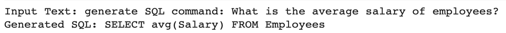

# SQL-generator-T5-model
1. This is a specialized T5-based large language model (LLM) that is fine-tuned to generate PostgreSQL queries from natural language text.
2. Trained "t5-small" model with spider dataset from HuggingFace datasets library. T5-Tokenizer is used for pre-processing the dataset. HuggingFace Transformers and PyTorch libraries are used to train the model.
3. The primary objective of this research project is to develop a domain-specific large language model (LLM) for databases,
aiming to enhance performance while also mitigating security vulnerabilities.
 
